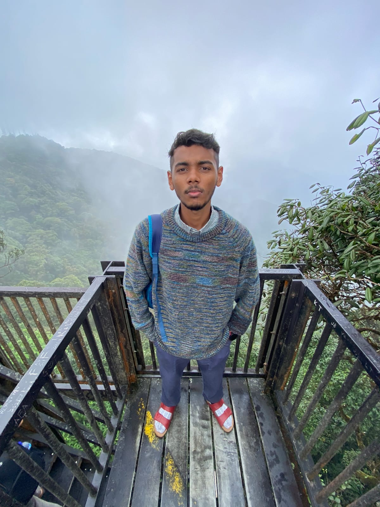
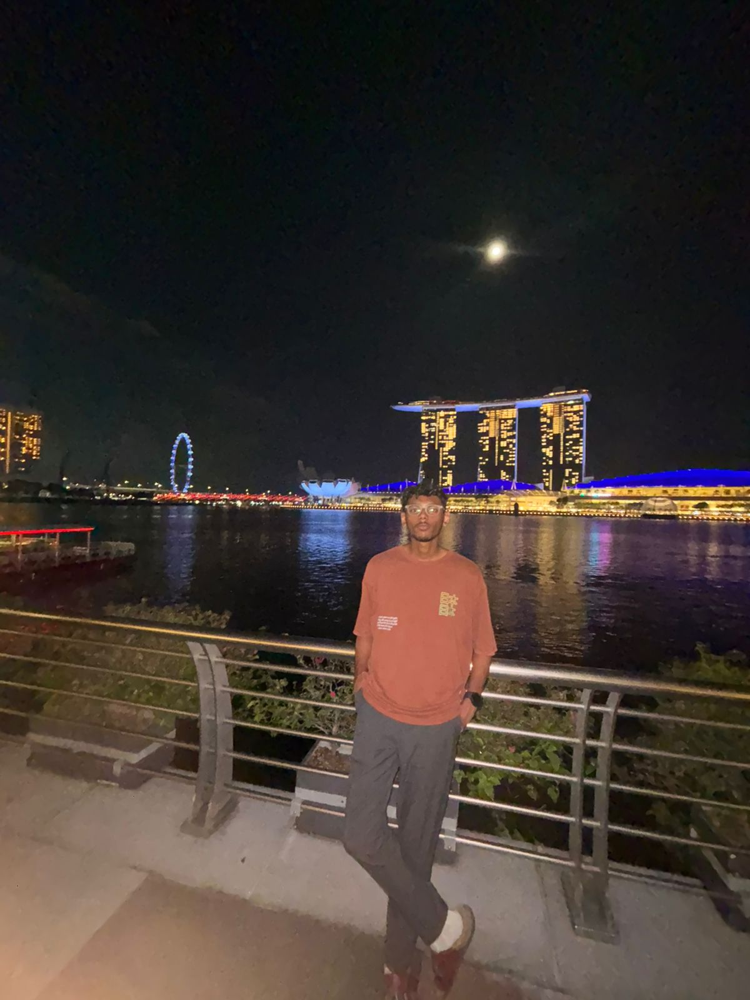
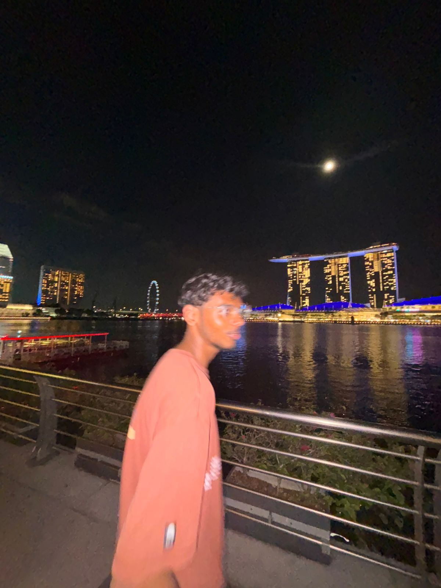

<div align="center">
  
</div>

# 🎉 Hey, I'm Mohammed Mohideen S A! 

<div align="center">
  
  
</div>

---

## 🌟 About Me

Hey there! I'm a **Computer Science student** on a mission to conquer the digital realm, one line of code at a time! I’m obsessed with crafting clever solutions, diving into wild tech experiments, and mastering the art of debugging (aka slaying bugs like a pro 🗡️). I geek out over C++, Python, and Flutter, and I’m always up for a coding challenge that sparks joy! When I’m not glued to my screen, you’ll find me gaming like a champ or dreaming up the next big app idea. 🚀

🌱 **Currently Exploring**: Machine Learning wizardry, REST API magic, Flutter state management (Bloc, Provider), and the art of CI/CD pipelines  
💬 **Talk to Me About**: Code battles, UI/UX sorcery, algorithms, or your wildest app ideas  
⚡ **Fun Fact**: I built a digital piano in C++ that plays tunes with keyboard taps—basically, I’m a coding rockstar! 🎹

<div align="center">
  
  
</div>

---

## 🎓 Education

- **B.Tech in Computer Science and Engineering**  
  *2023 - 2027 (Expected)*  
  Core Subjects: Data Structures & Algorithms, Operating Systems, DBMS, Computer Networks, Software Engineering, AI

---

## 🛠️ Tech Stack

<div align="center">
  
</div>

---

## 💻 Projects

- **[Task Manager](https://github.com/Mohideen2005/task_manager)**  
  A sleek Flutter app for task management with real-time notifications, persistent storage, and a dark/light UI.  
  *Tech*: Flutter, Dart  

- **[Student Information System](https://github.com/Mohideen2005)**  
  A C-based CLI app with CRUD operations, file storage, and sorting for student records.  
  *Tech*: C  

- **[Digital Piano](https://github.com/Mohideen2005)**  
  A C++ piano simulation with ASCII art and plans to add sound, keyboard mapping, and interactive playback.  
  *Tech*: C++, Java  

- **[Portfolio Website](https://github.com/Mohideen2005)**  
  A vibrant personal site showcasing projects, resume, and a contact form.  
  *Tech*: HTML, CSS, JavaScript  

- **[ChatBot Prototype](https://github.com/Mohideen2005)**  
  A Python chatbot with rule-based responses and basic NLP for fun interactions.  
  *Tech*: Python, NLP  

---

## 📊 GitHub Stats

<div align="center" style="animation: bounce 2s infinite;">
  
  
  
</div>

<style>
@keyframes bounce {
  0%, 100% { transform: translateY(0); }
  50% { transform: translateY(-10px); }
}
</style>

<div align="center">
  
  
</div>

---

## 🔍 Research & Interests

- **Tech Focus**: Optimizing cross-platform apps, async programming, mobile app security  
- **Learning**: Machine Learning, REST APIs, CI/CD, Flutter state management  
- **Hobbies**: App development, UI/UX design, open-source contributions, algorithmic puzzles, and gaming like a boss! 🎮

<div align="center">
  
  
</div>

---

## 📬 Connect with Me

<div align="center">
  <a href="https://www.linkedin.com/in/mohideensa2005/" target="_blank">
    
  </a>
  <a href="mailto:9923004120@klu.ac.in" target="_blank">
    
  </a>
  <a href="https://x.com/Mohideensa2005" target="_blank">
    
  </a>
  <a href="https://www.instagram.com/mohideen._.s.a/" target="_blank">
    
  </a>
</div>

---

## 🎨 Fun Widgets

<div align="center">
  
  
  
</div>

---

## 🖌️ ASCII Art

```ascii
   ____        _ _       
  |  _ \      (_) |      
  | |_) | __ _ _| |__   
  |  _ < / _` | | '_ \  
  | |_) | (_| | | |_) | 
  |____/ \__,_|_|_.__/  
